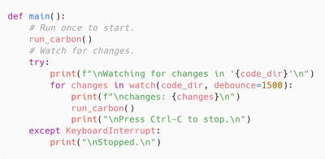

# run-carbon-cli

**Development work in progress**

Run [carbon-now-cli](https://github.com/mixn/carbon-now-cli), in a Docker container, automated with a Python script, to create code images when files containing source code snippets are changed.

---



---

## Requirements

This application was developed on Linux. The base requirements are **Docker** and **Python**.

It is recommended to use a Virtual Environment to separate Python package installations between different projects and your operating system's Python packages.

Initial setup:

``` bash
# Create a Python virtual environment named 'venv'
python3 -m venv venv

# Activate the virtual environment
source venv/bin/activate

# Install development requirements
pip install -r requirements-dev.txt

# Install project requirements
pip install -r requirements.txt
```

When returning to the project you only need to activate the virtual environment:

``` bash
source venv/bin/activate
```

## Build and Run the Docker Container

Run the following commands from the directory containing `Dockerfile`.

Build the image:

``` bash
docker build -t py-carbon-cli .
```

Run the container, mounting the local project's `code_files`, `config_files`, and `images` subdirectories as volumes:

``` bash
docker run --name crbn \
  -v $(pwd)/code_files:/app/code_files \
  -v $(pwd)/config_files:/app/config_files \
  -v $(pwd)/images:/app/images \
  -it py-carbon-cli
```

These are the parameters used:

- `--name` = Assign a name, in this case *crbn*, to reference the container in subsequent `docker` commands.
- `-v` = Bind mount a volume. In this case, three volumes are mounted.
  - The `code_files` directory has the source code snippets from which images are produced. This directory is watched for changes while the script is running.
  - The `config_files` directory can contain a carbon-now presets JSON file and an options file for `run_carbon_cli.py`.
  - The `images` directory is the destination for generated images.
- `-it` = `-i` (interactive) + `-t` (Allocate a pseudo-TTY)

When run, this opens a BASH shell. In the BASH shell, run the following to start the Python script:

``` bash
python3 run_carbon_cli.py
```

The script will run the `run_carbon()` function once, then start watching for changes in the `code_files` directory. The `run_carbon()` function is called again when a file is changed.

Press `ctrl+c` to stop the script. 

Type `exit` to close the BASH prompt in the container.

### Use for a documentation project

``` bash
docker run --name crbn \
  -v /home/user/DocumentationProject/code_files:/app/code_files \
  -v /home/user/DocumentationProject/config_files:/app/config_files \
  -v /home/user/DocumentationProject/images:/app/images \
  -it py-carbon-cli
```

This mounts the volumes pointing to subdirectories under `DocumentationProject` which has its own set of code and configuration files. If working on more than one project, use a different `--name` for each container instance. The name `crbn` is used in these examples, but it can be whatever you want (or you can skip the name and use the `ID` values assigned by Docker to reference containers).

## Other Docker Commands

See *running* containers: 

``` bash
docker ps
```

See *running* and *stopped* containers: 

``` bash
docker ps -a
```

Stop the running container named *crbn*: 

``` bash
docker stop crbn
```

Start the container named *crbn*: 

``` bash
docker start crbn
```

Connect an interactive TTY to get the BASH prompt in the running *crbn* container: 

``` bash
docker exec -it crbn bash
```

Remove the stopped *crbn* container (must be removed before doing another `build` and `run` to incorporate changes to the script or change volume paths):

``` bash
docker rm crbn
```

## Reference

### Carbon

Website: [Carbon](https://carbon.now.sh/): Create and share beautiful images of your source code

GitHub: [carbon-app/carbon](https://github.com/carbon-app/carbon): Create and share beautiful images of your source code

GitHub: [mixn/carbon-now-cli](https://github.com/mixn/carbon-now-cli): Beautiful images of your code — from right inside your terminal.

### Project Tools

- [Docker](https://docs.docker.com/) - Create, manage, and run containers
  - The [Official Python image](https://hub.docker.com/_/python) is used as the base image in the `Dockerfile` 

- [Ruff](https://docs.astral.sh/ruff/) - Python code linter and formatter

### Python Packages Used

- [pillow](https://pypi.org/project/pillow/) - Python Imaging Library fork
  - Pillow documentation: [Image.resize](https://pillow.readthedocs.io/en/stable/reference/Image.html#PIL.Image.Image.resize)
  - Pillow documentation: [Concepts - filters](https://pillow.readthedocs.io/en/stable/handbook/concepts.html#filters)

- [rich](https://pypi.org/project/rich/) - add color and style to terminal output

- [watchfiles](https://pypi.org/project/watchfiles/) - file watching and code reload in python

### Additional Links

Python Packaging User Guide: [Install packages in a virtual environment using pip and venv](https://packaging.python.org/en/latest/guides/installing-using-pip-and-virtual-environments/)

Docker Docs: [Volumes](https://docs.docker.com/storage/volumes/)

Dan Wahlin - Code with Dan Blog: [Docker Volumes and “print working directory” Command Syntax](https://blog.codewithdan.com/docker-volumes-and-print-working-directory-pwd/)
